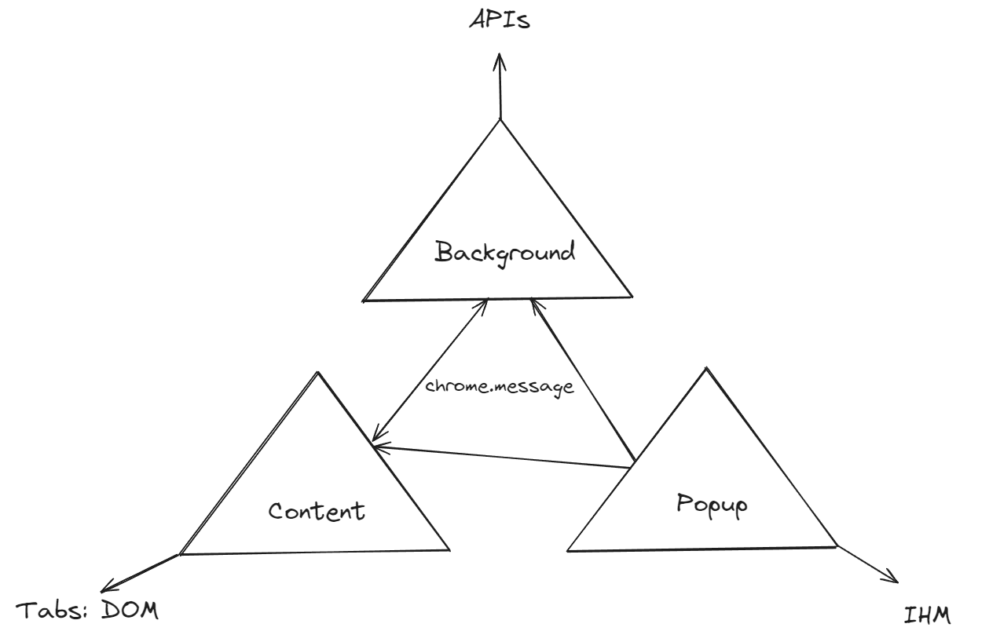

# Gold Extension

The extension for Gold service

## Loading an unpacked extension

Go to the Extensions page by entering chrome://extensions in a new tab. (By design chrome:// URLs are not linkable.)

Alternatively, click on the Extensions menu puzzle button and select Manage Extensions at the bottom of the menu.
Or, click the Chrome menu, hover over More Tools, then select Extensions.
Enable Developer Mode by clicking the toggle switch next to Developer mode.

Click the Load unpacked button and select the extension directory.

## Reloading the extension

After saving the file, to see this change in the browser you also have to refresh the extension. Go to the Extensions page and click the refresh icon next to the on/off toggle

## Architecture



## Setup

### For build

* Warning of your `.env.local` for surcharge configuration by default

For example
```
BACKGROUND_CONF=production.ts
BACKGROUND_BRANCH=develop
POPUP_BRANCH=develop
```

### For Popup

* Warning of your `config/popup/.env.local` for surcharge configuration by default

For example
```
REACT_APP_MODE=dev
```

### For Background

* Warning of your `config/background/production.ts` for surcharge configuration by default

For example
```
import { Configuration } from './configuration';

const conf: Configuration = {
  gold: {
    url: 'https://api.gold.happykiller.fr/',
  },
};

export { conf };
```

### For Content

* Warning of your `config/content/.env.local` for surcharge configuration by default

For example
```
REACT_APP_MODE=dev
```

## Prerequisites

* Node.js >= 18 and npm
* SSH access to the `Happykiller` GitHub org (the build clones the popup/background/content repos over SSH)
* `npm install` once at the repo root to install the build tooling

## Build

```bash
npm run build
```

`npm run build` does:
  * Load `.env` then `.env.local` (override)
  * Clean `./build` and `./temp`
  * For each module (popup, background, content): clone its repo at the configured branch, inject its config, `npm install`/`npm ci` + build, then copy the artifact into `./build`
  * Copy the `public/` folder (manifest, medias, etc.) into `./build`
  * Package `./archives/gold_<version>_<timestamp>.zip` and write a `.md` build report

## Dev

```bash
npm run dev
```

Fast re-assemble that reuses the already-built `./temp` output (run `npm run build` at least once first):
  * Load `.env` then `.env.local`
  * Clean `./build`
  * Copy each module's artifact into `./build`
  * Copy the `public/` folder
  * Re-package the zip and report

## Other scripts

* `npm run package` — re-zip an existing `./build` (and regenerate the report) without rebuilding
* `npm run clean` — remove `./build` and `./temp`